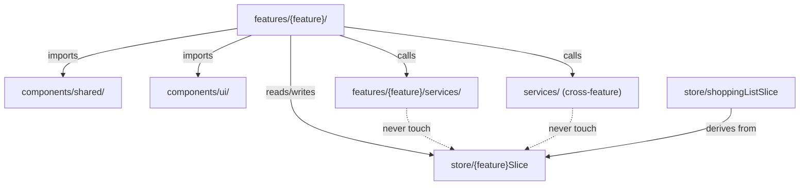
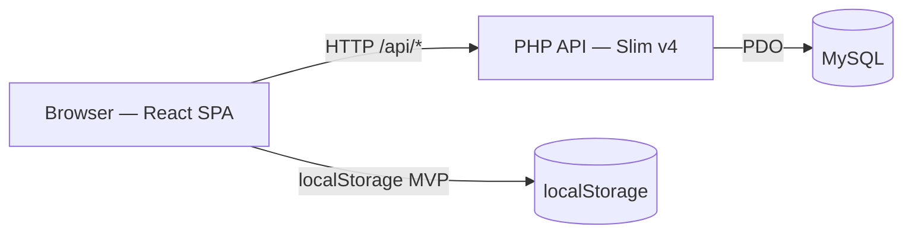
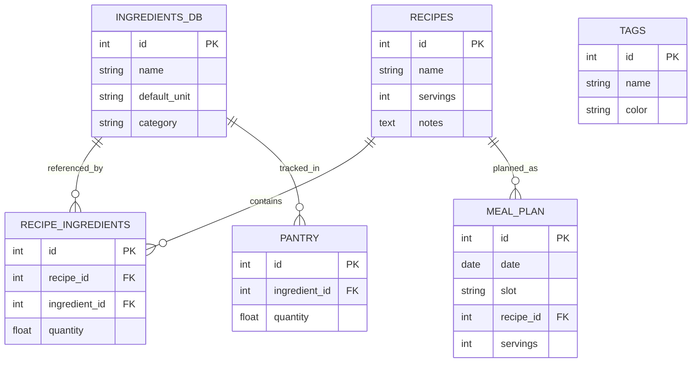

# Architecture Spine — Smart Shopping List

## Design Paradigm

Feature-sliced SPA (frontend) + Layered PHP REST API (backend). Each capability owns its own subtree; shared business components live in a dedicated shared layer; design primitives are isolated below that.



## Invariants & Rules

### AD-1 — Feature isolation with shared layer

- **Binds:** all frontend source
- **Prevents:** feature code bleeding across silos; agents modifying another feature's internals
- **Rule:** each feature owns `src/features/{feature}/`; components used by 2+ features live in `src/components/shared/`; design primitives in `src/components/ui/`; no direct cross-feature imports permitted

### AD-2 — Service layer abstraction

- **Binds:** all frontend data reads and writes
- **Prevents:** localStorage assumptions scattering into feature code; surgery required at API transition
- **Rule:** features never touch `localStorage` or `fetch` directly — they call a service function (e.g. `recipeService.getAll()`); feature-scoped services live in `src/features/{feature}/services/`; cross-feature services (e.g. `ingredientsDbService`) live in `src/services/`; hooks call the service then update Zustand — services never touch the store

### AD-3 — REST API response shape [ADOPTED]

- **Binds:** all PHP API endpoints and the frontend `apiFetch()` wrapper
- **Prevents:** frontend and backend agents building against different response contracts
- **Rule:** success → resource JSON body with 2xx status; error → `{ error: "message" }` with 4xx/5xx; a single `apiFetch()` wrapper on the frontend handles both uniformly

### AD-4 — Zustand store structure

- **Binds:** all frontend state
- **Prevents:** agent file collisions on a monolithic store file; shopping list being stored rather than derived
- **Rule:** one `createStore()` in `src/store/index.ts` composing all feature slices; each feature owns `src/store/{feature}Slice.ts`; `shoppingListSlice` contains selectors only — no state — enforcing the live-computed invariant

### AD-5 — API URL structure

- **Binds:** all PHP routes and frontend service layer
- **Prevents:** frontend and backend agents using different URL roots
- **Rule:** all routes prefixed `/api/` (e.g. `/api/recipes`, `/api/meal-plan`, `/api/pantry`); versioning (`/api/v1/`) added only when a second consumer requires it

### AD-6 — PHP backend folder structure

- **Binds:** all backend source under `api/`
- **Prevents:** agents organising PHP files inconsistently
- **Rule:** `api/src/Actions/` (one class per endpoint), `api/src/Repositories/` (DB queries per resource), `api/src/Routes/` (route definitions); follows standard Slim v4 conventions

### AD-7 — Meal plan data shape

- **Binds:** meal planner feature, localStorage schema, MySQL schema, `mealPlannerSlice`
- **Prevents:** week-keyed and date-keyed representations diverging between MVP and API phases
- **Rule:** each planned meal is `{ id, date: "YYYY-MM-DD", slot: "breakfast"|"lunch"|"dinner", recipeId, servings }`; the weekly calendar grid derives from these rows by filtering on date range

### AD-8 — localStorage ID generation

- **Binds:** all service layer `create()` functions in MVP phase
- **Prevents:** ID collisions; forward collision risk when multi-user lands
- **Rule:** `id: crypto.randomUUID()` for every new localStorage record; MySQL auto-increment takes over at API phase — no mapping needed since phases are a full swap

### AD-9 — localStorage key namespace

- **Binds:** all localStorage reads/writes
- **Prevents:** agents inventing inconsistent key names; browser storage collisions
- **Rule:** all keys prefixed `slist_` — `slist_recipes`, `slist_meal_plan`, `slist_pantry`, `slist_ingredients_db`, `slist_tags`

### AD-10 — Optimistic mutation flow [ADOPTED]

- **Binds:** all write operations across all features
- **Prevents:** inconsistent mutation patterns across features
- **Rule:** 1) update Zustand store immediately (optimistic); 2) call service; 3) on error: roll back store state + surface toast notification

## Consistency Conventions

| Concern | Convention |
| --- | --- |
| Naming (files, components) | kebab-case files; PascalCase components; camelCase functions/variables |
| Data & formats (ids, dates) | UUIDs (`crypto.randomUUID()`) in localStorage phase; auto-increment integers in API phase; dates as `"YYYY-MM-DD"` strings |
| State mutation | Optimistic update → service call → rollback + toast on error (AD-10) |
| Error display | Toast component (charcoal/amber variants per DESIGN.md); auto-dismiss |
| Units | Metric only: g, ml, kg, l, pcs, cloves, tbsp, tsp — enforced by `ingredients_db.default_unit` |
| Ingredient identity | Always by `ingredients_db` ID — never freeform strings in recipes or pantry |
| No unit column | `recipe_ingredients` has no unit column — unit always read from `ingredients_db.default_unit` |

## Stack

| Name | Version |
| --- | --- |
| React | 18.3.x |
| Vite | latest stable |
| Tailwind CSS | v4 |
| class-variance-authority | latest stable |
| Zustand | latest stable |
| TanStack Query | v5 (deferred — API phase only) |
| React Router | v6 |
| Lucide React | latest stable |
| React Hook Form | latest stable |
| PHP | 8.1+ |
| Slim Framework | v4 |
| illuminate/database | latest stable |
| php-di/php-di | v7 |
| Phinx | latest stable (dev-only) |
| PHPUnit | v11 |

## Structural Seed

```text
/
├── code/                        # React frontend (Vite project root)
│   └── src/
│       ├── features/
│       │   ├── recipes/         # Recipe CRUD + list
│       │   ├── meal-planner/    # Weekly calendar + meal assignment
│       │   ├── shopping-list/   # Checklist UI (computed, not stored)
│       │   ├── pantry/          # Home inventory
│       │   └── cook-now/        # Active cooking view
│       ├── components/
│       │   ├── ui/              # Design primitives (Button, Modal, Input…)
│       │   └── shared/          # Cross-feature business components (RecipeDetailModal, IngredientDetail…)
│       ├── store/               # Zustand slices + index.ts
│       ├── services/            # Cross-feature services (ingredientsDbService…)
│       └── styles/
│           └── tokens.css       # @theme design tokens
├── api/                         # PHP backend (Slim v4)
│   └── src/
│       ├── Actions/             # One class per endpoint
│       ├── Repositories/        # DB queries per resource
│       └── Routes/              # Route definitions
├── docs/                        # Stack and design decisions
└── design-v1/                   # Reference screenshots (read-only)
```





## Capability → Architecture Map

| Capability | Lives in | Governed by |
| --- | --- | --- |
| Recipe CRUD | `features/recipes/` | AD-1, AD-2, AD-8, AD-9 |
| Meal planning | `features/meal-planner/` | AD-1, AD-2, AD-7 |
| Shopping list (live-computed) | `store/shoppingListSlice` — selectors only | AD-4 |
| Pantry tracking | `features/pantry/` | AD-1, AD-2 |
| Cook Now | `features/cook-now/` | AD-1, AD-2 |
| Shared modals (RecipeDetailModal, IngredientDetail) | `components/shared/` | AD-1 |
| Design primitives | `components/ui/` | AD-1 |
| PHP REST API | `api/src/` | AD-3, AD-5, AD-6 |
| Ingredient canonical identity | `services/ingredientsDbService` | AD-2, conventions |

## Deferred

- TanStack Query integration — deferred to API phase; Zustand covers MVP entirely
- JWT auth (`tuupola/slim-jwt-auth`) — drops in without restructuring routes when multi-user is introduced
- API versioning — add `/v1/` route group prefix when a second consumer requires it
- Week templates / copy last week — post-MVP (CONTEXT.md)
- Nutritional data integration — post-MVP (CONTEXT.md)
- Mobile app — future; bare-body REST API is compatible with any mobile HTTP client
